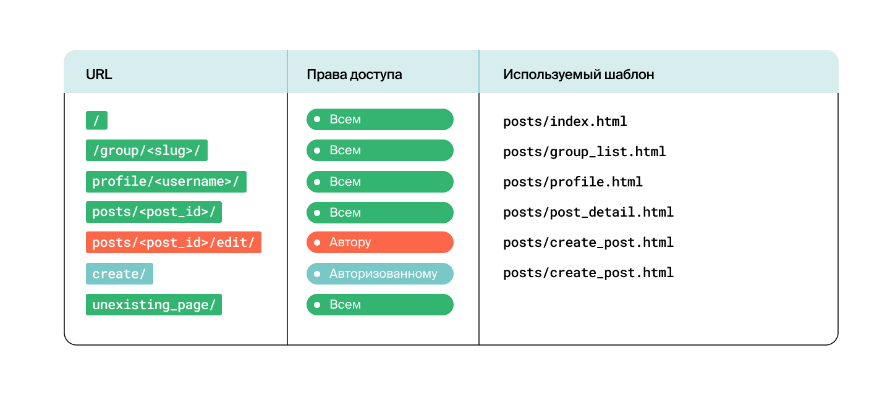
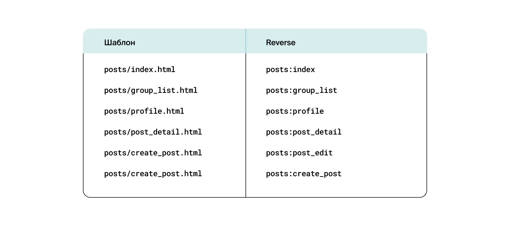

<a id = "anchor"></a>
# Тестирование платформы для публикаций Yatube

Test coverage - 98%

### Состав тесткейсов

1. Тестирование моделей Django
2. Тестирование URLs  
Запрос к несуществующей странице должен возвращать ошибку 404
<p align="left">
  
</p>

3. Тестирование Views: проверка шаблонов
<p align="left">
  
</p>

4. Тестирование Views: проверка контекста
<p align="left">
  
</p>

5. Тестирование Views: дополнительная проверка 

    5.1 Если при создании поста указать группу, то этот пост появляется:
    * на главной странице сайта
    * на странице выбранной группы
    * в профайле пользователя  

    5.2 Проверка того, что пост не попал в группу для которой не предназначен

6. Тестирование Forms  
    6.1 при отправке валидной формы со страницы создания поста reverse('posts:create_post') создаётся новая запись в базе данных  
    6.2 при отправке валидной формы со страницы редактирования поста reverse('posts:post_edit', args=('post_id',)) происходит изменение поста с post_id в базе данных
***
### Запуск тесткейсов
клонируйте репозиторий 
```
git clone git@github.com:andrey-kolesnik-moscow/hw04_tests.git
```
выполните команду
```
python manage.py test -v2
```
***

[В начало страницы](#anchor)
