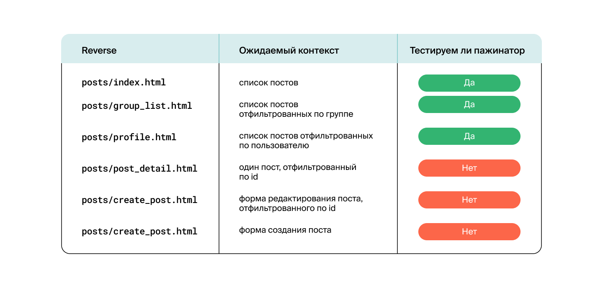

<a id="top"></a>
# 🧪 Yatube Platform Testing Documentation

[](tests/)
[](https://www.python.org/)
[](https://www.djangoproject.com/)

> **Comprehensive testing suite with 98% code coverage** 🎯

## 📊 Test Coverage Overview

**Current Coverage: 98%** 🎉

This project maintains high test coverage to ensure code quality, reliability, and maintainability. All critical functionality is thoroughly tested using Django's testing framework.

---

## 🧩 Test Case Categories

### 1. 🗃️ Django Models Testing
- Database model validation
- Field constraints and relationships
- Model methods and properties
- Data integrity checks

### 2. 🌐 URL Testing
- **404 Error Handling**: Requests to non-existent pages must return 404 errors
- URL pattern validation
- Redirect functionality
- URL parameter handling

<div align="center">
  
  <p><em>URL Testing Results</em></p>
</div>

### 3. 👁️ Views Testing: Template Verification
- Template rendering validation
- Correct template selection
- Template context availability
- Template inheritance testing

<div align="center">
  
  <p><em>Views Template Testing Results</em></p>
</div>

### 4. 📋 Views Testing: Context Validation
- Context data verification
- Variable passing to templates
- Data structure validation
- Context processor testing

<div align="center">
  
  <p><em>Views Context Testing Results</em></p>
</div>

### 5. 🔍 Advanced Views Testing

#### 5.1 Post Creation with Group Assignment
When creating a post with a specified group, the post must appear on:
- ✅ **Home page** (`/`)
- ✅ **Selected group page** (`/group/<group_name>/`)
- ✅ **User profile page** (`/profile/<username>/`)

#### 5.2 Group Isolation Testing
- ✅ Verify that posts do not appear in unintended groups
- ✅ Ensure proper group filtering and isolation

### 6. 📝 Forms Testing

#### 6.1 Post Creation Form
- **Valid Form Submission**: When submitting a valid form from the post creation page (`reverse('posts:create_post')`), a new record is created in the database
- Form validation testing
- Database insertion verification

#### 6.2 Post Editing Form
- **Valid Form Submission**: When submitting a valid form from the post editing page (`reverse('posts:post_edit', args=('post_id',))`), the post with the specified `post_id` is updated in the database
- Form validation testing
- Database update verification

---

## 🚀 Running Test Cases

### Prerequisites
- Python 3.8+
- Django 2.2.16
- All project dependencies installed

### Quick Start

1. **Clone the repository**
   ```bash
   git clone git@github.com:andrei-kolesnik-california/hw04_tests.git
   cd hw04_tests
   ```

2. **Run all tests with verbose output**
   ```bash
   python manage.py test -v2
   ```

### Additional Testing Commands

```bash
# Run specific test categories
python manage.py test posts.tests.test_models -v2
python manage.py test posts.tests.test_views -v2
python manage.py test posts.tests.test_forms -v2

# Run tests with coverage report
coverage run --source='.' manage.py test
coverage report
coverage html  # Generate HTML coverage report

# Run tests in parallel (if available)
python manage.py test --parallel
```

---

## 📈 Test Results Interpretation

### Coverage Metrics
- **98% Coverage**: Excellent test coverage
- **Green Tests**: All tests passing
- **No Skipped Tests**: Complete test execution

### What the Tests Validate
- ✅ **Functionality**: All features work as expected
- ✅ **Edge Cases**: Error handling and boundary conditions
- ✅ **Data Integrity**: Database operations and constraints
- ✅ **User Experience**: Template rendering and context
- ✅ **Security**: Form validation and CSRF protection

---

## 🛠️ Test Structure

```
tests/
├── conftest.py              # Test configuration
├── fixtures/                # Test data fixtures
│   ├── fixture_data.py     # Sample data
│   └── fixture_user.py     # User fixtures
├── test_about.py           # About page tests
├── test_auth_urls.py       # Authentication URL tests
├── test_comment.py         # Comment functionality tests
├── test_create.py          # Post creation tests
├── test_follow.py          # Follow system tests
├── test_homework.py        # Homework-specific tests
├── test_paginator.py       # Pagination tests
├── test_post.py            # Post functionality tests
├── test_profile.py         # Profile page tests
└── utils.py                # Test utilities
```

---

## 🎯 Testing Best Practices

### ✅ What We Test
- **Models**: Database operations and relationships
- **Views**: Request handling and response generation
- **Forms**: Data validation and processing
- **URLs**: Routing and error handling
- **Templates**: Rendering and context
- **Integration**: End-to-end functionality

### 🔧 Testing Tools
- **Django TestCase**: Primary testing framework
- **Client**: Simulate HTTP requests
- **Fixtures**: Reusable test data
- **Mocking**: Isolate components for testing
- **Coverage**: Measure test completeness

---

## 📊 Performance Testing

The test suite is optimized for:
- ⚡ **Fast Execution**: Tests run quickly
- 🔄 **Reliability**: Consistent results
- 📦 **Isolation**: Tests don't interfere with each other
- 🧹 **Clean State**: Database is reset between tests

---

<div align="center">

🎉 **Excellent test coverage ensures your code is robust and reliable!** 🎉

</div>

---

[⬆️ Back to Top](#top)
